# Alpha Pilot Bot OKX 业务逻辑分支流程图

## 📊 系统概述
Alpha Pilot Bot OKX 是一个基于AI驱动的自动化交易系统，采用模块化架构设计，实现智能交易决策、风险管理和系统维护。

---

## 🔄 主交易循环流程图

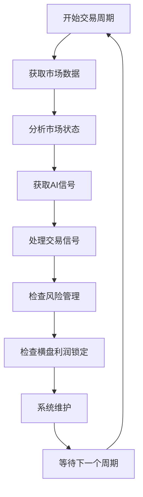

---

## 🎯 详细业务逻辑分支

### 1. 市场数据获取流程

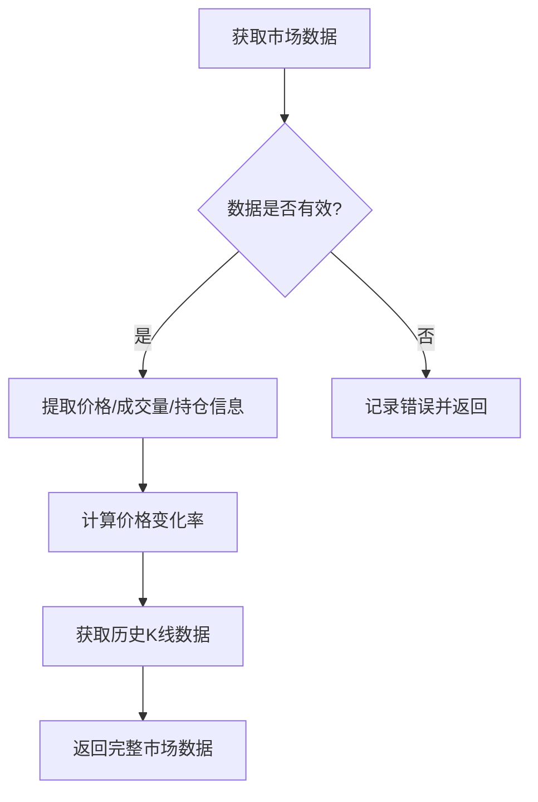

### 2. 市场状态分析流程

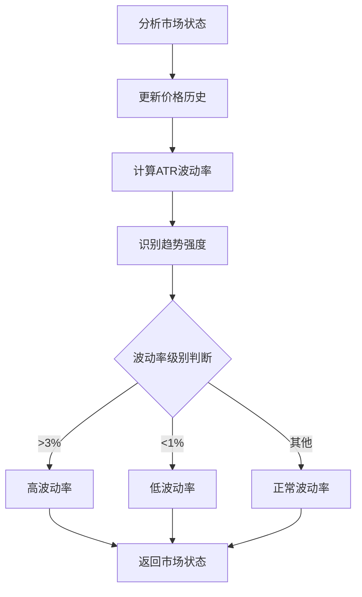

### 3. AI信号获取与融合流程

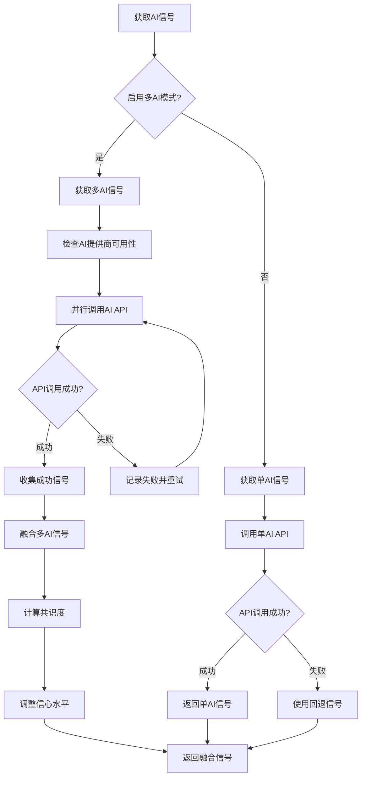

### 4. AI信号融合详细逻辑

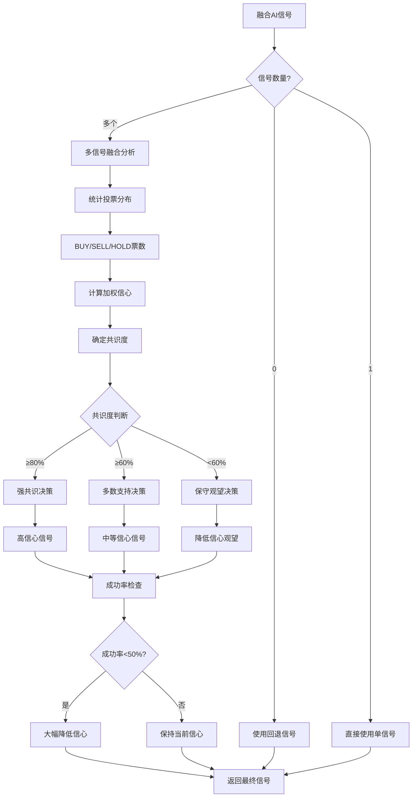

### 5. 交易信号处理流程

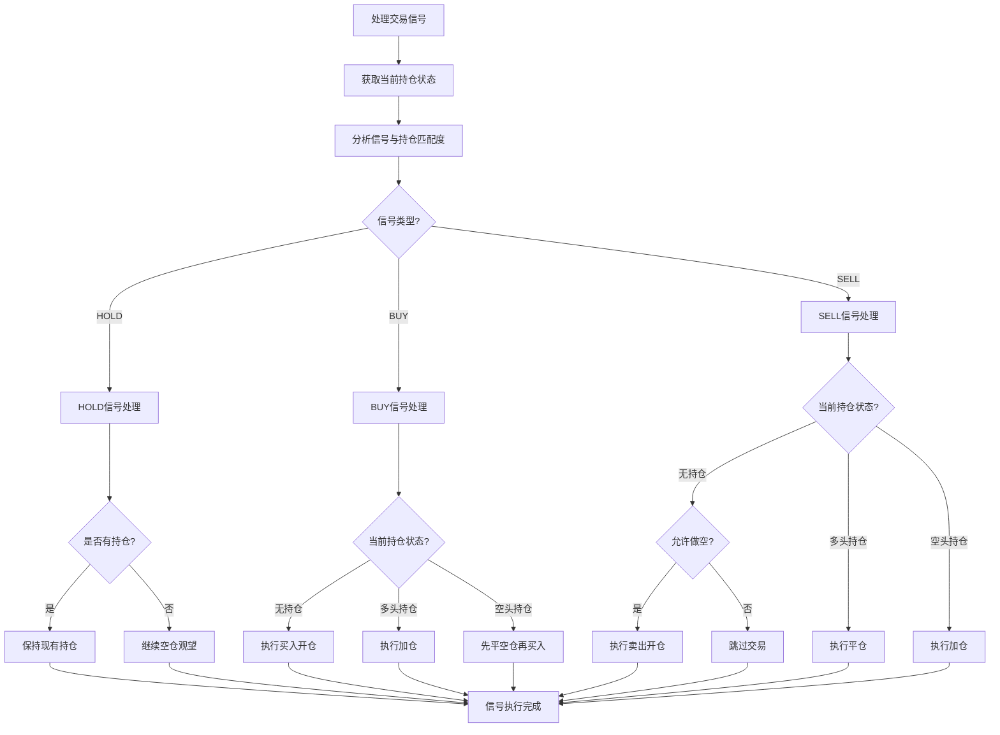

### 6. 风险管理流程

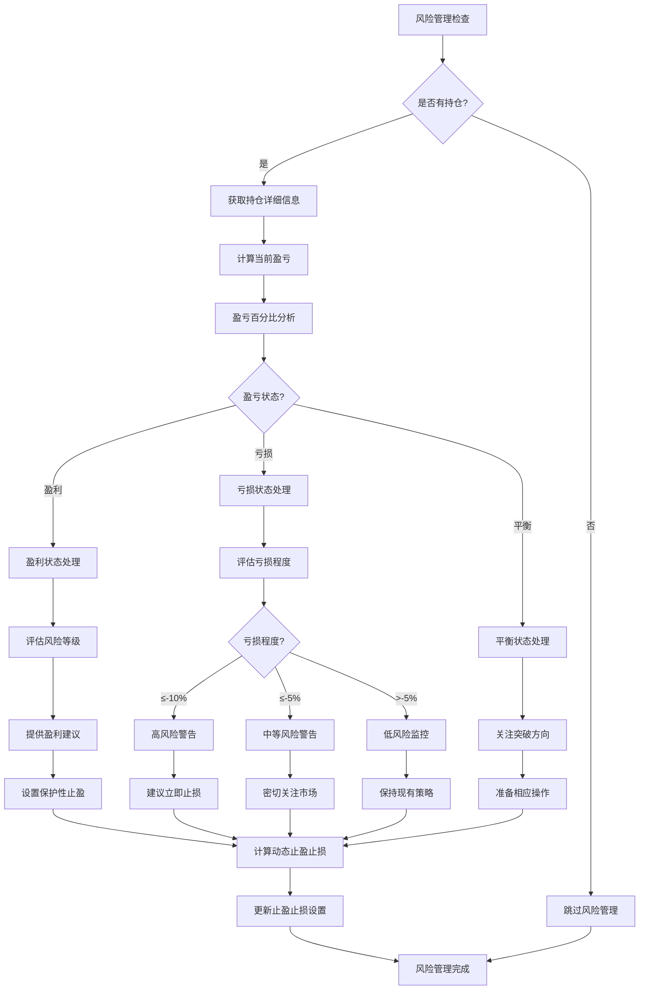

### 7. 横盘检测与处理流程

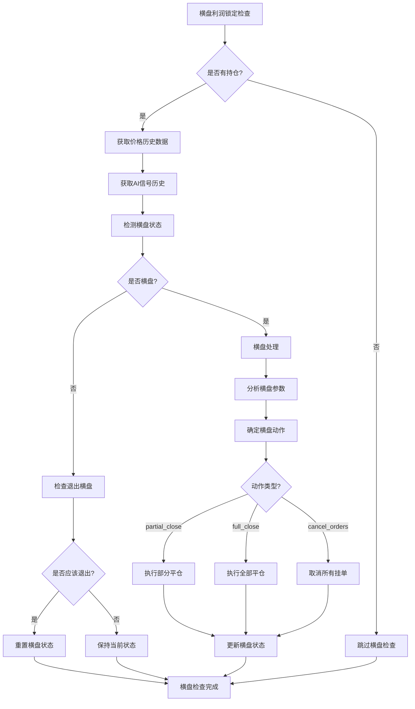

### 8. 合约数量标准化流程

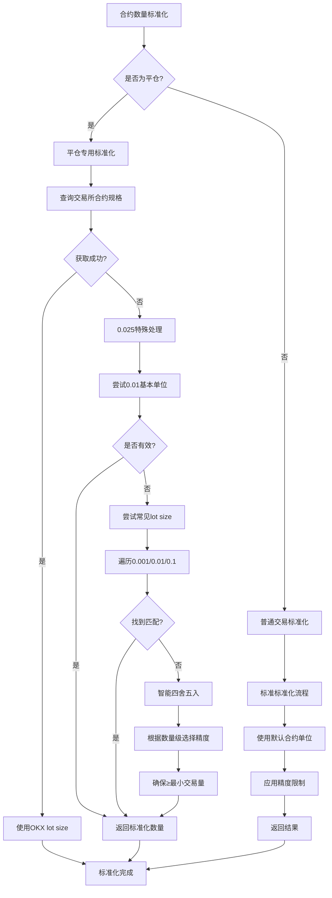

### 9. AI信号获取重试机制

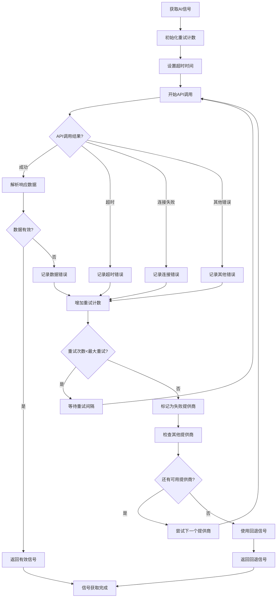

### 10. 系统维护流程

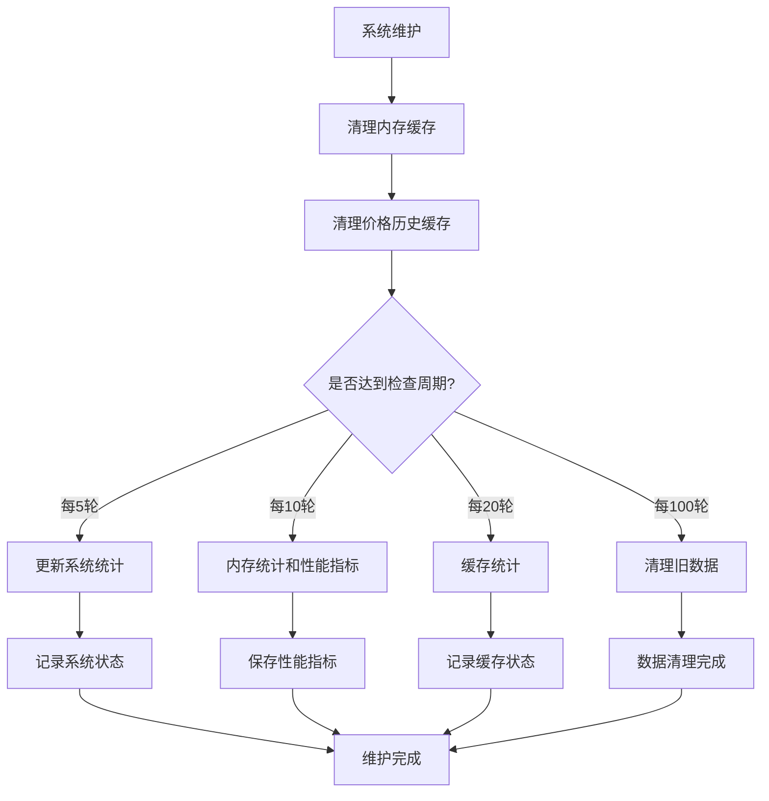

---

## 🎯 关键决策点说明

### 1. AI信号融合决策逻辑
- **强共识 (≥80%)**: 直接使用高信心信号
- **多数支持 (≥60%)**: 使用中等信心信号
- **无明显共识 (<60%)**: 保守观望，降低信心

### 2. 风险管理决策逻辑
- **盈利状态**: 设置保护性止盈，上调止损位
- **亏损状态**: 
  - ≤-10%: 高风险警告，建议立即止损
  - ≤-5%: 中等风险，密切关注
  - >-5%: 低风险监控
- **平衡状态**: 关注突破方向，保持现有设置

### 3. 合约数量标准化策略
- **优先策略**: 查询交易所实际合约规格
- **特殊处理**: 0.025数量使用0.01基本单位
- **备选策略**: 尝试常见lot size组合
- **最终回退**: 智能四舍五入到合理精度

### 4. 横盘检测触发条件
- 价格波动率低于阈值
- 持续时间超过设定值
- AI信号持续为HOLD
- 持仓处于盈利状态

---

## 🔧 配置参数影响

### 关键配置参数
1. **AI融合阈值**: 影响信号决策的严格程度
2. **风险管理参数**: 影响止盈止损设置
3. **横盘检测参数**: 影响横盘识别灵敏度
4. **合约标准化参数**: 影响订单数量精度

### 调优建议
- **保守型**: 提高共识度阈值，降低风险容忍度
- **激进型**: 降低共识度要求，提高风险容忍度
- **平衡型**: 使用默认参数，适合大多数情况

---

## 📋 修改指南

### 常见修改场景

1. **调整AI融合逻辑**: 修改 `ai_client.py` 中的 `fuse_signals()` 方法
2. **优化风险管理**: 修改 `main.py` 中的 `_update_risk_management()` 方法
3. **改进横盘检测**: 修改 `strategies.py` 中的横盘检测逻辑
4. **调整合约标准化**: 修改 `trading.py` 中的 `_standardize_contract_amount()` 方法

### 测试验证
- 使用 `syntax_check.py` 验证语法正确性
- 使用模拟模式测试新逻辑
- 查看详细日志确认行为符合预期

---

*最后更新: 2025年12月6日*
*版本: v2.1 - 增强决策透明度版*