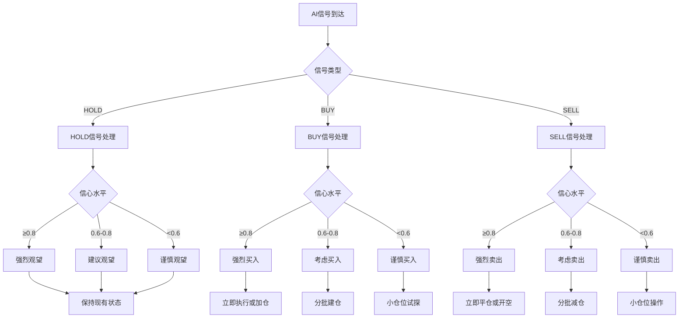
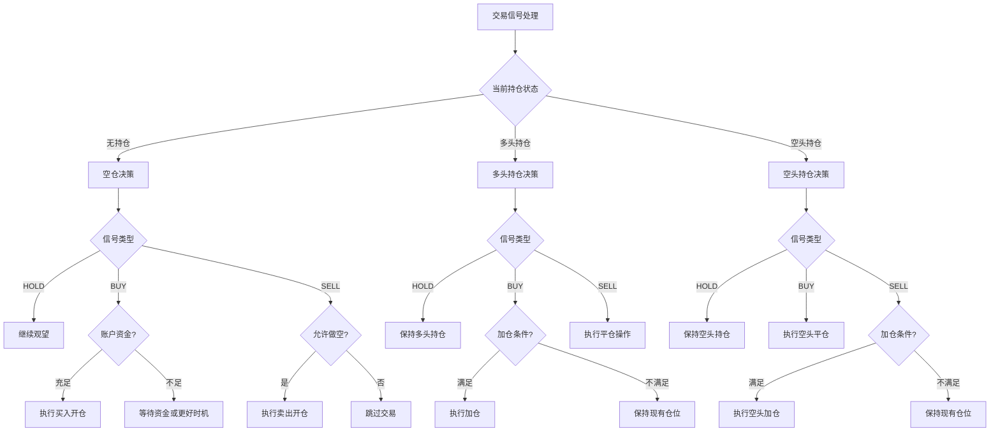
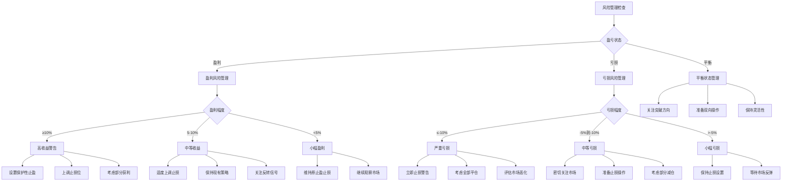
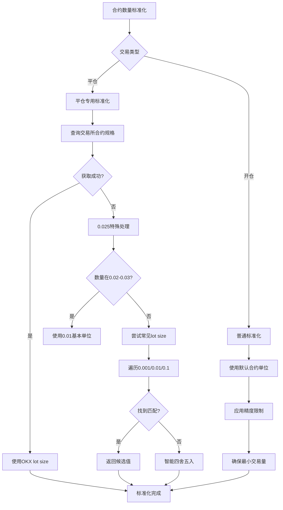
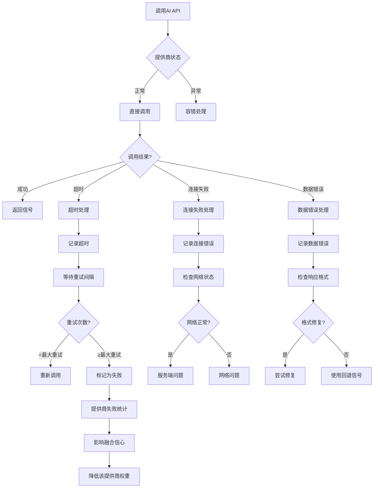
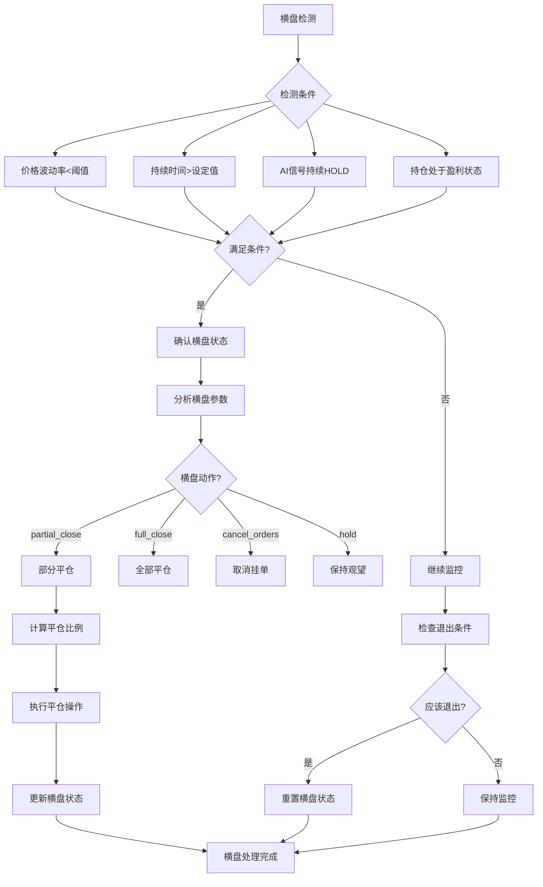

# Alpha Pilot Bot OKX 详细决策分支流程图

## 🎯 核心决策分支详解

### 分支1: AI信号强度决策矩阵



### 分支2: 持仓状态决策树



### 分支3: 风险管理决策矩阵



### 分支4: 合约数量标准化决策树



### 分支5: AI提供商容错处理



### 分支6: 横盘检测与处理逻辑



---

## 🔧 关键配置参数影响

### 1. AI融合参数
```yaml
ai_fusion:
  consensus_threshold: 0.8      # 强共识阈值
  majority_threshold: 0.6       # 多数支持阈值
  success_rate_threshold: 0.5   # 成功率阈值
  confidence_adjustment: 0.7    # 失败时的信心调整
```

### 2. 风险管理参数
```yaml
risk_management:
  high_risk_threshold: 0.10     # 高风险盈亏阈值
  medium_risk_threshold: 0.05   # 中等风险阈值
  stop_loss_multiplier: 0.98    # 止损倍数
  take_profit_multiplier: 1.06  # 止盈倍数
```

### 3. 横盘检测参数
```yaml
consolidation:
  price_range_threshold: 0.02   # 价格波动阈值
  duration_threshold: 30        # 持续时间阈值(分钟)
  profit_threshold: 0.01        # 盈利阈值
  partial_close_ratio: 0.5      # 部分平仓比例
```

### 4. 合约标准化参数
```yaml
contract_standardization:
  default_lot_size: 0.001       # 默认合约单位
  special_range_min: 0.02       # 特殊处理范围最小值
  special_range_max: 0.03       # 特殊处理范围最大值
  precision_small: 3            # 小数量精度
  precision_medium: 2           # 中等数量精度
  precision_large: 1            # 大数量精度
```

---

## 📝 修改指南

### 常见修改场景

#### 场景1: 调整AI融合严格度
**文件**: `ai_client.py`
**方法**: `fuse_signals()`
**修改点**: 
- 调整 `consensus_threshold` 和 `majority_threshold`
- 修改信心调整逻辑

#### 场景2: 优化风险管理策略
**文件**: `main.py`
**方法**: `_update_risk_management()`
**修改点**:
- 调整风险等级阈值
- 修改止盈止损计算逻辑
- 优化盈亏状态建议

#### 场景3: 改进横盘检测灵敏度
**文件**: `strategies.py`
**方法**: `detect_consolidation()`
**修改点**:
- 调整价格波动阈值
- 修改持续时间要求
- 优化横盘动作选择

#### 场景4: 修复合约数量精度问题
**文件**: `trading.py`
**方法**: `_standardize_contract_amount()`
**修改点**:
- 添加新的lot size候选值
- 调整特殊处理范围
- 优化降级策略

### 测试验证步骤

1. **语法检查**:
   ```bash
   python3 syntax_check.py
   ```

2. **模拟模式测试**:
   - 设置 `test_mode: true`
   - 观察详细日志输出
   - 验证决策逻辑正确性

3. **关键场景测试**:
   - AI提供商部分失败场景
   - 不同盈亏状态的持仓
   - 0.025等特殊合约数量
   - 横盘状态触发和退出

4. **日志分析**:
   - 检查决策理由是否合理
   - 验证风险管理建议是否恰当
   - 确认合约标准化是否成功

---

## ⚠️ 注意事项

### 1. 修改前备份
- 备份原始配置文件
- 记录当前参数设置
- 保存历史交易数据

### 2. 渐进式修改
- 一次只修改一个分支逻辑
- 小幅度调整参数
- 充分测试后再进行下一步

### 3. 监控指标
- 交易成功率变化
- 盈亏比例变化
- AI信号稳定性
- 系统运行稳定性

### 4. 回滚机制
- 保留修改历史
- 准备快速回滚方案
- 设置异常告警

---

## 📊 性能监控指标

### 1. 决策质量指标
- AI信号准确率
- 融合信号稳定性
- 回退信号使用频率

### 2. 风险管理效果
- 最大回撤控制
- 止损执行率
- 盈利保护效果

### 3. 系统稳定性
- API调用成功率
- 异常处理效率
- 日志记录完整性

---

*最后更新: 2025年12月6日*
*版本: v2.2 - 详细决策分支版*